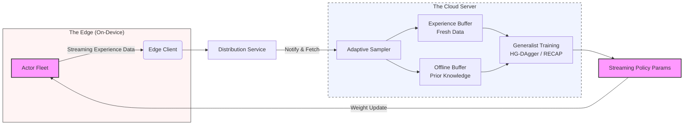

# The Era of Earned Intelligence

## **Hyperion Thesis**

The robotics industry is reaching an inflection point. The bottleneck is no longer the complexity of the neural network, but the richness of the data fed into it. Hyperion is built on the premise that the "ImageNet moment" for robotics will not happen in a lab, but in the wild.

### **Three Core Insights**

**1. The Population Inversion**

We are entering into decades where humanoid robots and mobile manipulators will eventually outnumber humans, filling critical gaps in labor and logistics both on earth and beyond.

**2. The Real-World Gap**

Third-party "pre-training" datasets are inherently static. They capture a moment in time, often in controlled environments, and rarely reflect the "high-entropy" chaos of a live customer site, resulting in strong distribution shifts.

**3. On-Policy Supremacy**

The most valuable data for robot learning is **on-policy rollouts -** data generated by the robot's own actions and interactions. The largest and most valuable data source will be the shared, online experiences of an interconnected fleet deployed in the wild.

## **Parallel Learning**

Humans are bound by linear time; an apprentice can only learn from the mistakes they personally make. AI robotics, however, can massively leverage **parallel experience**.

*"If you have 10,000 robots, they don't just learn 10,000 times faster; they learn from 10,000 different edge cases simultaneously."*

This insight exposes a critical flaw in the current market. Today, companies are selling robotic datasets, often to companies that haven't even deployed their first ten robots. But buying data is a static fix for a dynamic problem. As deployment numbers grow, the volume of "online" data,  generated by robots actually doing economically valuable work, will quickly dwarf anything available for purchase.

## **Hyperion Cloud**

Hyperion is Continual Learning Infrastructure for AI robotics. Whether a fleet is running GR00T N1.6 or a new World Action Model (WAM), Hyperion Cloud provides the data and training pipelines necessary to efficiently convert fleet experiences into an optimized model.

### **How It Works**

The system operates through a specialized continuous learning loop:

**1. The Edge (Actor Fleet)**

A distributed fleet of N actors (humanoids, manipulators, or bases) performs different tasks in real-world environments, streaming experience data through an Edge Client to the Distribution Service.

**2. Hyperion Cloud** 

An Adaptive Sampler pulls from both an Experience Buffer (fresh fleet data) and an Offline Buffer (prior knowledge). Using post-training algorithms like HG-DAgger or RECAP, the system refines the shared policy through generalist training.

**3. The Return Loop**

Updated weights are evaluated in simulation against the prior model, then streamed back to the fleet, creating a continuous improvement cycle.

## **Adaptation Churn**

We expect that the primary reason many robotics companies will fail at the customer level is **Adaptation Time**. When a fleet enters a custom environment and fails consistently without showing signs of improvement, customers perceive the company poorly, leading to high churn and refund requests.

### **The Hyperion Advantage**

Hyperion-powered fleets learn from each other. This collective intelligence dramatically reduces the time it takes for a robot to "settle in" to a new environment. Additionally, Hyperion's clients optimize their models based on data with:

- **Zero distribution shift** (the data comes from their actual deployment environments)
- **Order of magnitude lower costs** (collection costs are offset by revenue from the economically valuable work being performed)

---

## **Early Validation**

Three weeks since the first commit, we have validated Hyperion's value by applying it to GR00T N1.6 performing four different tasks across parallel **RoboCasa** environments.

**Results:** In just **45 minutes** of online experience across these environments, Hyperion improved GR00T N1.6 by **11% on average**.

[include tasks with improvements in bar chart]

---

## **What's Next**

**Scaling Simulation**

We are increasing the scale of simulation runs to identify benefits at larger fleet sizes and longer training windows.

**Deployment Partners**

Once we verify Hyperion at scale, we will approach **2-3 AI robotics labs** with active robot fleets deployed. Hyperion will serve as the "Deployment Partner," providing the infrastructure to turn their fleet's daily online experiences into a model that continuously learns and self-improves.